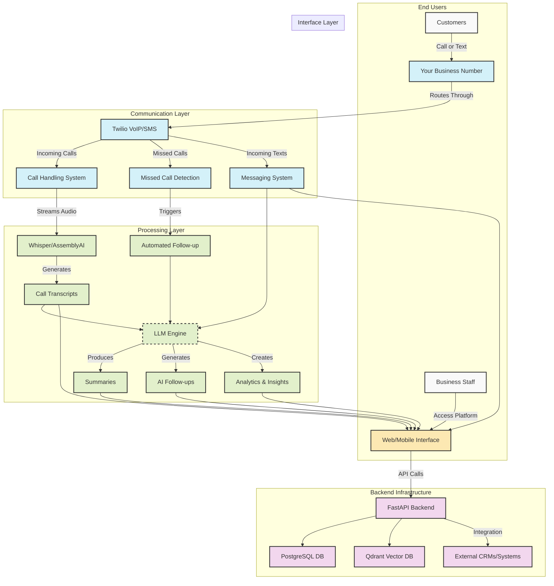

# AI-Powered VoIP Platform for Repair Businesses

## High-Level Overview
To build this platform, we need to combine three main layers: communication infrastructure (VoIP & messaging), an AI engine for automation, and a clean user interface to manage everything.

## System Architecture

## Component Breakdown

### 1. Communication Layer
We'll use **Twilio** for VoIP calls and SMS. It handles incoming/outgoing calls, voicemail, missed call detection, and routing logic. This provides a reliable foundation for all customer communications.

### 2. Transcription Engine
We'll stream audio (via Twilio Media Streams) to an external transcription model like **Whisper or AssemblyAI**, then store the text. This enables real-time conversion of voice to actionable data.

### 3. AI Automation
Once we have the transcript, we'll use a **language model** (like GPT-4 or Claude) to:
* Summarize calls
* Generate follow-ups
* Convert voicemails to text messages
* Identify customer sentiment and urgent issues
* Suggest appropriate responses

### 4. Inbox UI
Build a unified web-based inbox using **React or Vue + FastAPI backend**, where users can see all calls, texts, and AI-suggested responses. This would include responsive design for mobile access, ensuring staff can respond from anywhere.

### 5. Backend Infrastructure
Use **PostgreSQL for metadata**, **Qdrant for vector search**, and host everything on **Cloud Run, Heroku, or Kubernetes** depending on scale. This architecture ensures both performance and flexibility as your business grows.

### 6. Integration & Security
Implement secure API endpoints for integration with existing business systems (CRMs, ticketing systems) and ensure end-to-end encryption for all communications. This protects sensitive customer information while making the platform work seamlessly with your existing tools.

## Implementation Timeline & Team

For an MVP, a small team of 2–3 developers could ship a working version in about **5–6 weeks**:
- Week 1–2: Twilio setup + routing
- Week 3–4: Inbox UI + transcription
- Week 5–6: AI integrations + polish

The system would be designed with scalability in mind, able to efficiently grow from dozens to thousands of users through containerization and load balancing.

## Why Choose This Solution

This platform addresses key pain points for repair businesses:
- **Missed opportunities**: Never miss a call or text with unified communications
- **Inefficient follow-ups**: AI automatically generates appropriate responses
- **Poor customer experience**: Seamless communication across channels improves satisfaction
- **Limited insights**: Call analytics help identify trends and improvement areas
- **Staff overwhelm**: Automation handles routine responses, freeing up your team

Since I've already built GenAI products with messaging, vector search, and AI responses, I could prototype the core AI layer quickly and iterate based on user feedback.

## Competitive Advantage

While competitors like Podium offer similar functionality, our solution will be:
1. Specifically tailored to repair business workflows
2. More deeply integrated with AI for automation
3. Designed for seamless scaling as your business grows
4. Built with open integration capabilities for your existing tools

Let's discuss how we can customize this solution to meet your specific business needs.
